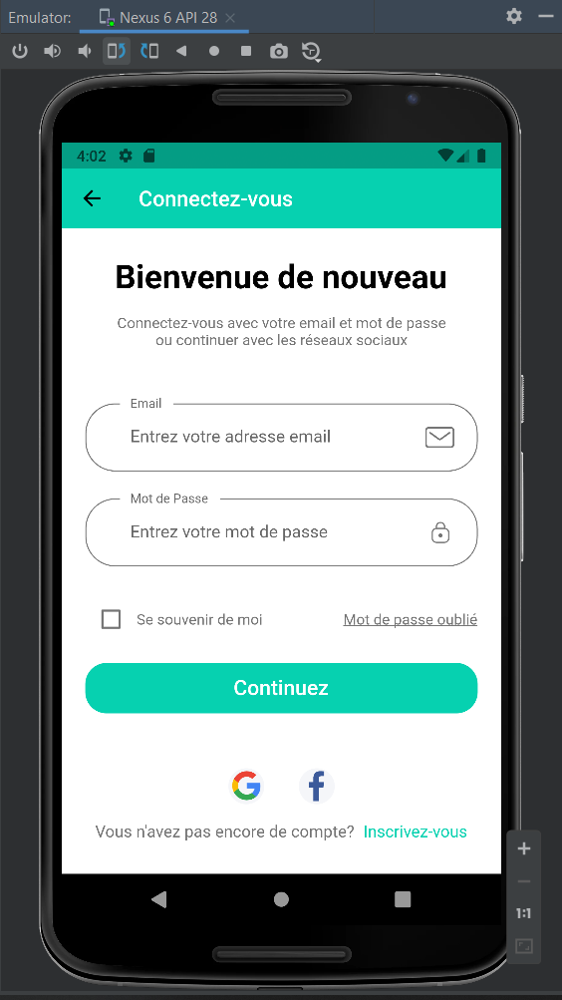
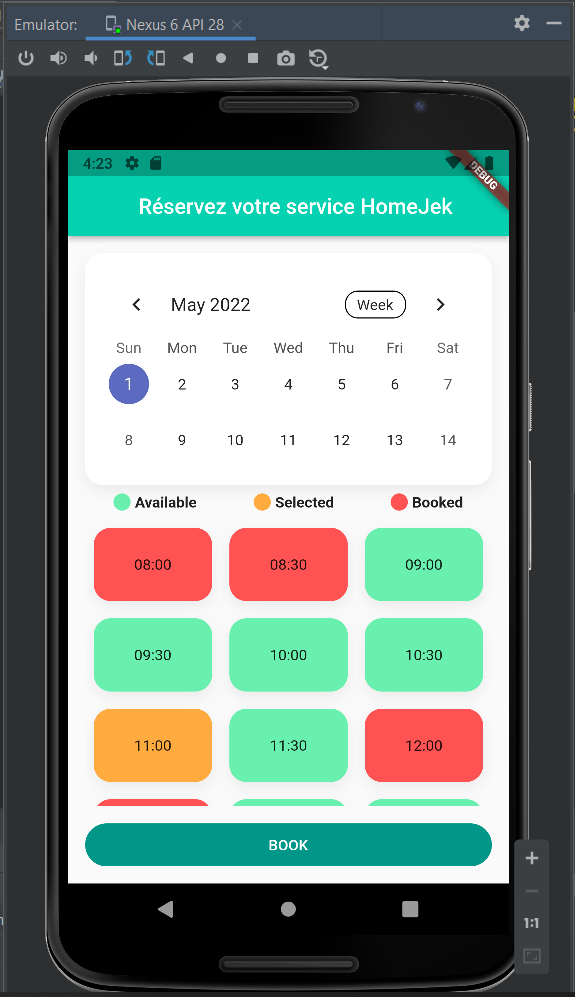

# OnDemand Service Reservation App (in French)

# Introduction

This is a Flutter-based mobile application that provides a streamlined platform for clients to browse, book, and manage reservations for various services, while service providers can manage client requests and view completed tasks. It also includes an admin dashboard accessible via a web interface for managing categories, services, and complaints. (Check my other repos for the dashboard).
The app is built using Flutter for the frontend, providing a smooth and responsive user experience across both iOS and Android devices.

# Client Interface

Register View

Choose to register as service provider of a simple client.

Choose category if service provider box is checked.

Phone Verification View

Login View

Forgot Password View

Success View

Home View - Recommendations

Profile View

Home View - Services

Service Card View

Cart View

Booking Calendar View

Payment Form View

Payment Success View

Location Permission View

Track Service Provider View

# Service Provider Interface

Service providers can view available jobs.

Service providers can accept or decline client service requests.

Service providers can receive notifications and track services they have completed and those still in progress.

# Installation

To run this project locally, follow these steps:

Clone the repository:
git clone https://github.com/yourusername/service-reservation-app.git
cd service-reservation-app

Install dependencies: Make sure you have the rigth Flutter version installed (Dart SDK version: >=2.16.1 <3.0.0, which corresponds to Flutter 2.10.x or 2.12.x.). Then, run:
flutter pub get

Run the app: Use the following command to launch the app on your device or emulator:
flutter run

Build the app for release (optional):
flutter build apk --release

# Conclusion

Thank you for checking out the Service Reservation App! We hope this README has been helpful in setting up and understanding the app's functionality.
